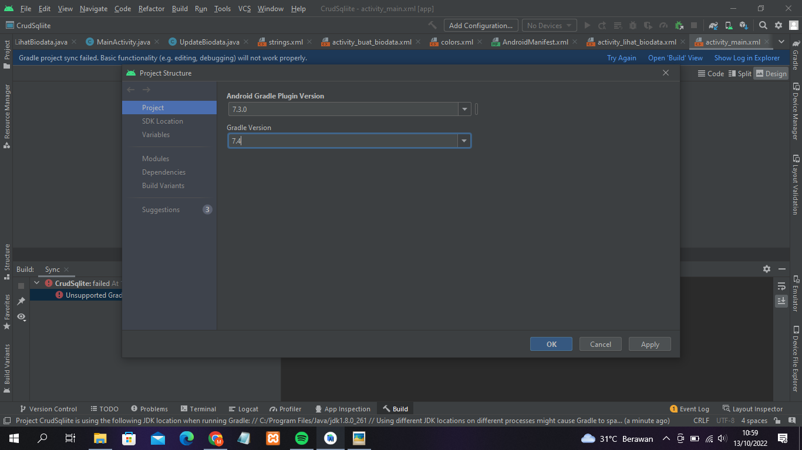

# TUGAS 6 PEMOGRAMAN MOBILE

### NAMA : MILA YUNITA
### NIM : 2041720027
### KELAS : TI-3C
 

## Langkah-Langkah Penyelesaian
1. Mengubah versi gradle. Pada menu File yang ada di pojok kiri atas, memilih opsi Project Structure. Pada jendela Project Structure memilih menu Project. Kemudian mengisikan verisi 7.3.0 unutk Android Gradle Plugin dan versi 7.4 untuk gradle. Mengklik Apply.

2. Mengganti Gradle JDK. Pada menu SDK Location menekan link Gradle Settings yang ada di sebelah kiri bawah. Memilih opsi "Android Studio default JDK" pada kolom Grade JDK. Lalu mengklik OK.

3. Ketika mengklik link "Try Again" yang ada di pojok kanan atas, masih terdapat error saat program dijalankan. Menekan link "Add gradle Maven repository and sync project" yang ada pada terminal.

 

4. Membuka file <b>build.gradle (Module: CrudSqlite.app)</b> yang ada di dalam folder Gradle Script. Kemudian mengatur isi method dependencies seperti di bawah ini.

5. Pada file <b>build.gradle (Project CrudSqlite)</b> yang ada di dalam folder Gradle Script, mengubah versi gradle menjadi 7.2.1 seperti hasil screenshot di bawah ini. Kemudian menekan link "Try Again" yang ada di pojok kanan untuk mencoba mlakukan sinkronisasi gradle kembali.

6. Sudah tidak terdapat error. Hal tersebut menunjukkan bahwa proses sinkronisasi gradle berhasil dilakukan.

 

## Hasil Screenshoot tampilan saat dijalankan di handphone
1. Tampilan awal Ketika aplikasi dijalankan

2. Mencoba Fitur Create dengan menekan tombol "Buat Bidoata Baru"

3. Tampilan ketika data berhasil ditambahkan.

4. Tampilan ketika mengklik salah satu data. Akan muncul fitur lihat data, update data, dan hapus data.

5. Mencoba fitur Lihat Data

6. Mencoba fitur Update Data "MILA YUNITA" menjadi "MILA Y"

7. Hasil ketika data berhasil di-update

8. Mencoba fitur Hapus Biodata. Data "MILA Y" berhasil dihapus.
